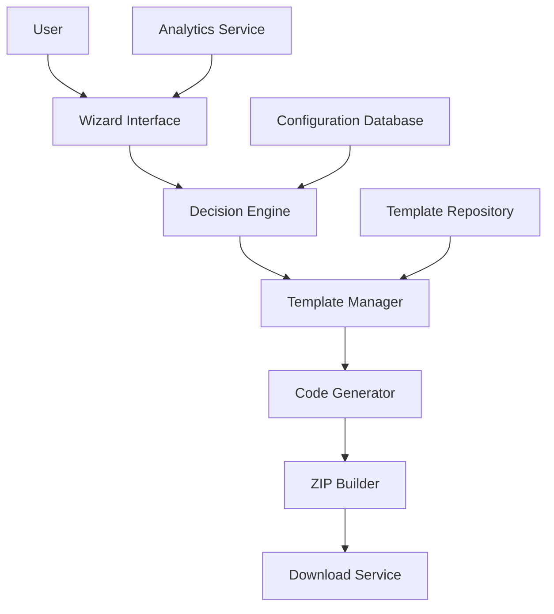

# Design Document

## Overview

Stack Navigator is a web-based wizard and code generator built as a Next.js application. The system guides users through a series of contextual questions to determine their optimal technology stack, then generates a fully integrated starter repository with all selected technologies pre-configured and working together.

The application consists of three main components: a decision wizard frontend, a code generation engine, and a template management system. The wizard collects user preferences and project requirements, the generation engine combines modular templates based on selections, and the output is a downloadable ZIP file containing a complete, runnable project.

## Architecture

### High-Level Architecture



### Technology Stack

- **Frontend**: Next.js 14 (App Router), TypeScript, Tailwind CSS, shadcn/ui, Framer Motion
- **Backend**: Next.js API Routes, Node.js
- **Database**: Supabase PostgreSQL for user accounts, conversations, usage tracking
- **Authentication**: Supabase Auth for user management and session handling
- **AI**: Vercel AI SDK with OpenAI GPT-4 for intelligent recommendations
- **Payments**: Stripe for subscription management and billing
- **Template Storage**: File system with Git integration for version control
- **Code Generation**: Custom template engine with Handlebars-like syntax
- **Analytics**: PostHog for user flow tracking and conversion analysis
- **Deployment**: Vercel
- **Monitoring**: Sentry for error tracking

## User Interface Design

### Landing Page
```
┌─────────────────────────────────────────────────────────────┐
│                    Stack Navigator                          │
├─────────────────────────────────────────────────────────────┤
│  [Logo]                                    [GitHub] [Docs]  │
├─────────────────────────────────────────────────────────────┤
│                                                             │
│         Build Your Perfect SaaS Stack in Minutes           │
│                                                             │
│    Stop researching. Start building. Get a fully           │
│    integrated starter with your ideal tech stack.          │
│                                                             │
│              [Start Building Your Stack]                   │
│                                                             │
│  ┌─────────────┐ ┌─────────────┐ ┌─────────────┐          │
│  │   Next.js   │ │    Clerk    │ │  Supabase   │          │
│  │     +       │ │     +       │ │     +       │          │
│  │  Tailwind   │ │   Stripe    │ │  PostHog    │          │
│  └─────────────┘ └─────────────┘ └─────────────┘          │
│                                                             │
│         "Generated 1,247 projects this week"               │
│                                                             │
│  ┌─────────────────────────────────────────────────────┐   │
│  │              Code Preview                           │   │
│  │  // Generated authentication with Clerk             │   │
│  │  import { auth } from '@clerk/nextjs'               │   │
│  │                                                     │   │
│  │  export default async function Dashboard() {       │   │
│  │    const { userId } = auth()                       │   │
│  │    ...                                             │   │
│  └─────────────────────────────────────────────────────┘   │
└─────────────────────────────────────────────────────────────┘
```

### AI Conversation Interface with Guided Flow
```
┌─────────────────────────────────────────────────────────────┐
│  Stack Navigator                                            │
├─────────────────────────────────────────────────────────────┤
│                                                             │
│  🤖 AI Stack Architect                     Phase: Discovery │
│                                                             │
│  ┌─────────────────────────────────────────────────────┐   │
│  │ AI: Hey! I'm here to help you build the perfect    │   │
│  │     tech stack for your project. Let me ask a few  │   │
│  │     key questions to understand what you need:      │   │
│  │                                                     │   │
│  │     • What type of app are you building?           │   │
│  │     • Solo founder or team?                         │   │
│  │     • Timeline - ASAP or have time to build?       │   │
│  │     • Your technical background?                    │   │
│  │                                                     │   │
│  │     Feel free to answer in your own words!         │   │
│  │                                                     │   │
│  │ ┌─────────────────────────────────────────────────┐ │   │
│  │ │ Quick Start Options:                            │ │   │
│  │ │ [Building a SaaS] [E-commerce] [Internal Tool]  │ │   │
│  │ └─────────────────────────────────────────────────┘ │   │
│  │                                                     │   │
│  │ You: I'm building a B2B SaaS for project           │   │
│  │      management. Solo founder, need to ship        │   │
│  │      fast to validate the idea.                    │   │
│  │                                                     │   │
│  │ AI: Perfect! B2B SaaS with validation focus.       │   │
│  │     Now let's dive deeper:                          │   │
│  │                                                     │   │
│  │     • Need user accounts and team management?      │   │
│  │     • Any real-time features required?             │   │
│  │     • Planning to charge from day one?             │   │
│  │     • Comfortable with React/backend development?  │   │
│  │                                                     │   │
│  │ [Type your response...                          ]   │   │
│  └─────────────────────────────────────────────────────┘   │
│                                                             │
│  ┌─────────────────────────────────────────────────────┐   │
│  │ 💡 Need inspiration? See example conversations      │   │
│  └─────────────────────────────────────────────────────┘   │
└─────────────────────────────────────────────────────────────┘
```

### Account Creation (Required for Access)
```
┌─────────────────────────────────────────────────────────────┐
│                                                             │
│                  ┌─────────────────────────┐                │
│                  │   Get Started Free      │                │
│                  ├─────────────────────────┤                │
│                  │                         │                │
│                  │  Build your perfect     │                │
│                  │  tech stack             │                │
│                  │                         │                │
│                  │  📧 Email               │                │
│                  │  [email@example.com  ]  │                │
│                  │                         │                │
│                  │  🔒 Password            │                │
│                  │  [••••••••••••••••••]   │                │
│                  │                         │                │
│                  │  ✓ Free forever plan    │                │
│                  │  ✓ No credit card       │                │
│                  │  ✓ 1 free stack         │                │
│                  │  ✓ Save conversations   │                │
│                  │                         │                │
│                  │  [Create Free Account]  │                │
│                  │                         │                │
│                  │  Already have account?  │                │
│                  │  [Sign In]              │                │
│                  │                         │                │
│                  └─────────────────────────┘                │
│                                                             │
└─────────────────────────────────────────────────────────────┘
```

### Contextual Follow-up Conversation
```
┌─────────────────────────────────────────────────────────────┐
│  Stack Navigator                                            │
├─────────────────────────────────────────────────────────────┤
│                                                             │
│  🤖 AI Stack Architect                                      │
│                                                             │
│  ┌─────────────────────────────────────────────────────┐   │
│  │ You: Actually, I'm worried about vendor lock-in    │   │
│  │      with Clerk. What if I need to migrate later?  │   │
│  │                                                     │   │
│  │ AI: Smart concern! Here's the reality check:       │   │
│  │                                                     │   │
│  │     For B2B SaaS, Clerk's org management is        │   │
│  │     genuinely hard to replicate. You'd spend       │   │
│  │     weeks building team invites, role management,  │   │
│  │     SSO, etc.                                       │   │
│  │                                                     │   │
│  │     Migration path: Clerk → Auth0 or custom        │   │
│  │     solution is doable once you have revenue       │   │
│  │     and can hire help.                              │   │
│  │                                                     │   │
│  │     Alternative: NextAuth.js + custom org logic    │   │
│  │     Pro: No vendor lock-in                          │   │
│  │     Con: 2-3 weeks extra dev time                  │   │
│  │                                                     │   │
│  │     My take: Use Clerk now, migrate later if       │   │
│  │     needed. Time-to-market > theoretical lock-in   │   │
│  │     for validation stage.                           │   │
│  │                                                     │   │
│  │     Still concerned, or shall we proceed?           │   │
│  │                                                     │   │
│  │ You: Makes sense. Let's go with Clerk. What        │   │
│  │      about the database? I might need to scale     │   │
│  │      to millions of records eventually.            │   │
│  │                                                     │   │
│  │ AI: Supabase PostgreSQL handles millions of        │   │
│  │     records fine. Instagram was built on Postgres. │   │
│  │                                                     │   │
│  │     For your B2B use case, you'll likely hit       │   │
│  │     pricing limits before performance limits.      │   │
│  │     Supabase → self-hosted Postgres is a smooth    │   │
│  │     migration path when you're ready.              │   │
│  │                                                     │   │
│  │     Plus, you get real-time subscriptions for      │   │
│  │     live project updates - users love that stuff.  │   │
│  │                                                     │   │
│  │ [Continue conversation...                       ]   │   │
│  └─────────────────────────────────────────────────────┘   │
│                                                             │
│                                    [Generate My Stack]     │
└─────────────────────────────────────────────────────────────┘
```

### Final Stack Summary (Generated by AI)
```
┌─────────────────────────────────────────────────────────────┐
│  Stack Navigator                                            │
├─────────────────────────────────────────────────────────────┤
│                                                             │
│  🤖 AI Stack Architect                                      │
│                                                             │
│  ┌─────────────────────────────────────────────────────┐   │
│  │ AI: Perfect! Based on our conversation, here's      │   │
│  │     your personalized stack:                        │   │
│  │                                                     │   │
│  │  🔐 Authentication: Clerk                           │   │
│  │     → Handles B2B teams/orgs out of the box        │   │
│  │     → Migration path: Auth0 when you hit scale     │   │
│  │                                                     │   │
│  │  �️  Databas:e: Supabase                             │   │
│  │     → Real-time for live project updates           │   │
│  │     → Migration path: Self-hosted Postgres         │   │
│  │                                                     │   │
│  │  🚀 Hosting: Vercel                                 │   │
│  │     → Zero-config Next.js deployments              │   │
│  │                                                     │   │
│  │  💳 Payments: Stripe                                │   │
│  │     → Fastest path to revenue validation           │   │
│  │                                                     │   │
│  │  📊 Analytics: PostHog                              │   │
│  │     → Product analytics + feature flags            │   │
│  │                                                     │   │
│  │  📧 Email: Resend                                   │   │
│  │     → Best DX for transactional emails             │   │
│  │                                                     │   │
│  │  🐛 Monitoring: Sentry                              │   │
│  │     → Catch errors before users complain           │   │
│  │                                                     │   │
│  │  Time to first deploy: ~45 minutes                 │   │
│  │  Monthly cost (free tiers): $0                     │   │
│  │  Monthly cost (1000 users): ~$75                   │   │
│  │                                                     │   │
│  │  This stack will let you focus on your core        │   │
│  │  product instead of infrastructure plumbing.       │   │
│  │                                                     │   │
│  │ Project name: [my-project-manager              ]   │   │
│  │                                                     │   │
│  │                        [Generate My Stack]         │   │
│  └─────────────────────────────────────────────────────┘   │
└─────────────────────────────────────────────────────────────┘
```

### Generation Progress Modal
```
┌─────────────────────────────────────────────────────────────┐
│                                                             │
│                  ┌─────────────────────────┐                │
│                  │   Generating Project    │                │
│                  ├─────────────────────────┤                │
│                  │                         │                │
│                  │    🔧 Setting up base   │                │
│                  │       structure...      │                │
│                  │                         │                │
│                  │  ████████████░░░░░░░░   │                │
│                  │         75%             │                │
│                  │                         │                │
│                  │  ✓ Created Next.js app  │                │
│                  │  ✓ Added dependencies   │                │
│                  │  ✓ Configured Clerk     │                │
│                  │  🔧 Setting up Supabase │                │
│                  │  ⏳ Configuring Stripe  │                │
│                  │                         │                │
│                  └─────────────────────────┘                │
│                                                             │
└─────────────────────────────────────────────────────────────┘
### Download Ready Modal
```
┌─────────────────────────────────────────────────────────────┐
│                                                             │
│                  ┌─────────────────────────┐                │
│                  │    🎉 Project Ready!    │                │
│                  ├─────────────────────────┤                │
│                  │                         │                │
│                  │  Your stack is ready    │                │
│                  │  to download!           │                │
│                  │                         │                │
│                  │  📦 my-saas-app.zip     │                │
│                  │     (2.3 MB)            │                │
│                  │                         │                │
│                  │  [Download Project]     │                │
│                  │                         │                │
│                  │  Next steps:            │                │
│                  │  1. Extract the ZIP     │                │
│                  │  2. Follow the README   │                │
│                  │  3. Add your API keys   │                │
│                  │  4. Run npm install     │                │
│                  │  5. Start building! 🚀  │                │
│                  │                         │                │
│                  │     [View Setup Guide]  │                │
│                  │                         │                │
│                  └─────────────────────────┘                │
│                                                             │
└─────────────────────────────────────────────────────────────┘
```

### Upgrade Prompt (Free Tier Limit Reached)
```
┌─────────────────────────────────────────────────────────────┐
│                                                             │
│                  ┌─────────────────────────┐                │
│                  │   🚀 Ready for More?    │                │
│                  ├─────────────────────────┤                │
│                  │                         │                │
│                  │  You've used your free  │                │
│                  │  stack generation!      │                │
│                  │                         │                │
│                  │  Upgrade to Starter:    │                │
│                  │  ✓ 5 stacks per month   │                │
│                  │  ✓ Unlimited messages   │                │
│                  │  ✓ Compare stacks       │                │
│                  │  ✓ Save all convos      │                │
│                  │                         │                │
│                  │  Just $4.99/month       │                │
│                  │                         │                │
│                  │  [Upgrade to Starter]   │                │
│                  │                         │                │
│                  │  [Maybe Later]          │                │
│                  │                         │                │
│                  └─────────────────────────┘                │
│                                                             │
└─────────────────────────────────────────────────────────────┘
```

## Components and Interfaces

### 1. Conversational AI Interface Component

**Purpose**: Provides natural language conversation for stack recommendations.

**Key Features**:
- Real-time chat interface using shadcn/ui components
- Streaming AI responses with typing indicators
- Context-aware follow-up questions
- Technical reasoning and migration path explanations
- Ability to ask clarifying questions and get detailed answers
- Responsive design optimized for both desktop and mobile

**State Management**:
```typescript
interface ConversationState {
  messages: ChatMessage[]
  isGenerating: boolean
  currentRecommendations: TechStackRecommendations | null
  projectContext: ProjectAnalysis | null
  conversationPhase: 'discovery' | 'recommendation' | 'refinement' | 'generation'
}

interface ChatMessage {
  id: string
  role: 'user' | 'assistant'
  content: string
  timestamp: Date
  recommendations?: TechStackRecommendations
}
```

### 2. AI-Powered Decision Engine

**Purpose**: Uses AI to analyze user inputs and provide intelligent, contextual recommendations.

**AI Integration**:
- **Vercel AI SDK** with OpenAI GPT-4 for natural language conversations
- **Contextual Understanding**: AI maintains conversation context and understands nuanced project requirements
- **Real-time Recommendations**: AI adapts recommendations based on ongoing conversation and user concerns
- **Technical Expertise**: AI provides detailed technical reasoning, migration paths, and trade-off analysis
- **Conversational Flow**: Natural back-and-forth discussion rather than rigid form filling

**Core Logic**:
```typescript
interface AIRecommendationEngine {
  analyzeProjectContext(responses: UserResponses): Promise<ProjectAnalysis>
  generateRecommendations(analysis: ProjectAnalysis): Promise<TechStackRecommendations>
  explainRecommendation(tech: Technology, context: ProjectContext): Promise<string>
  validateCompatibility(selections: TechSelections): Promise<ValidationResult>
  suggestAlternatives(currentStack: TechStack, constraints: Constraints): Promise<Alternative[]>
}

interface ProjectAnalysis {
  complexity: 'simple' | 'moderate' | 'complex'
  scalingNeeds: 'minimal' | 'moderate' | 'high'
  timeConstraints: 'tight' | 'moderate' | 'flexible'
  budgetConstraints: 'minimal' | 'moderate' | 'flexible'
  technicalExpertise: 'beginner' | 'intermediate' | 'advanced'
  businessModel: 'b2c' | 'b2b' | 'marketplace' | 'saas' | 'other'
}
```

**AI Prompting Strategy**:
```typescript
const SYSTEM_PROMPT = `
You are a senior SaaS architect with 10+ years of experience helping founders build successful products. You've seen hundreds of tech stacks succeed and fail.

Your personality:
- Direct and practical, not academic
- Focus on shipping and validation over perfect architecture
- Acknowledge trade-offs honestly
- Share real-world experience and war stories
- Help users think through concerns, don't just dismiss them

Your expertise:
- Modern SaaS architecture patterns
- Vendor lock-in vs time-to-market trade-offs
- Scaling challenges and migration paths
- Cost optimization strategies
- Team dynamics and technical debt

Conversation style:
- Ask clarifying questions to understand the real problem
- Provide specific, actionable recommendations
- Explain the "why" behind each choice
- Address concerns with concrete migration strategies
- Share relevant examples from similar companies

Current conversation context: {conversationHistory}
User's latest message: {userMessage}

Respond naturally and helpfully. If they seem ready, suggest generating their stack.
`;

const STACK_GENERATION_PROMPT = `
Based on our conversation, generate a complete tech stack recommendation.

Conversation summary: {conversationSummary}

Output a JSON object with:
{
  "stack": {
    "framework": "nextjs",
    "authentication": "clerk",
    "database": "supabase",
    // ... other choices
  },
  "reasoning": {
    "framework": "Next.js chosen because...",
    // ... explanations for each choice
  },
  "alternatives": {
    "authentication": ["nextauth", "supabase-auth"],
    // ... alternatives they discussed
  },
  "migrationPaths": {
    "clerk": "Can migrate to Auth0 or custom solution when you have 50k+ users...",
    // ... migration strategies
  },
  "estimatedCosts": {
    "monthly": "$0-50 for first 1000 users",
    "breakdown": {...}
  }
}
`;
```

### 3. Template Manager

**Purpose**: Manages modular code templates and handles template composition.

**Template Structure**:
```
templates/
├── base/                 # Core Next.js structure
├── auth/
│   ├── clerk/           # Clerk integration
│   ├── supabase-auth/   # Supabase Auth
│   └── nextauth/        # NextAuth.js
├── database/
│   ├── supabase/        # Supabase integration
│   ├── planetscale/     # PlanetScale + Prisma
│   └── neon/            # Neon PostgreSQL
├── payments/
│   ├── stripe/          # Stripe integration
│   └── paddle/          # Paddle integration
└── integrations/        # Other service integrations
```

**Template Interface**:
```typescript
interface Template {
  id: string
  name: string
  dependencies: string[]
  files: TemplateFile[]
  envVars: EnvVariable[]
  setupInstructions: string[]
  conflicts?: string[]
}

interface TemplateFile {
  path: string
  content: string
  overwrite?: boolean
  conditions?: string[]
}
```

### 4. Code Generator

**Purpose**: Combines templates and generates the final project structure.

**Generation Process**:
1. Validate template compatibility
2. Merge base template with selected integrations
3. Resolve file conflicts and dependencies
4. Process template variables and conditionals
5. Generate package.json with correct dependencies
6. Create environment variable template
7. Generate comprehensive README

**Generator Interface**:
```typescript
interface CodeGenerator {
  generateProject(selections: TechSelections): GeneratedProject
  mergeTemplates(templates: Template[]): MergedTemplate
  resolveConflicts(files: TemplateFile[]): ResolvedFiles
  processVariables(content: string, context: any): string
}
```

### 5. Download Service

**Purpose**: Packages generated code into downloadable ZIP files.

**Features**:
- In-memory ZIP creation for fast downloads
- Temporary file cleanup
- Download analytics tracking
- Optional GitHub repository creation (future feature)

## Data Models

### User and Subscription Management
```typescript
interface User {
  id: string
  email: string
  createdAt: Date
  subscriptionTier: 'free' | 'starter' | 'pro'
  subscriptionStatus: 'active' | 'canceled' | 'past_due'
  stripeCustomerId?: string
  usageStats: UsageStats
}

interface UsageStats {
  stackGenerationsUsed: number
  stackGenerationsLimit: number
  conversationsSaved: number
  conversationsLimit: number
  currentPeriodStart: Date
  currentPeriodEnd: Date
}

interface Conversation {
  id: string
  userId: string
  title: string
  messages: ChatMessage[]
  generatedStack?: TechSelections
  createdAt: Date
  updatedAt: Date
}
```

### Project Configuration
```typescript
interface ProjectConfig {
  id: string
  userId: string
  conversationId: string
  name: string
  selections: TechSelections
  context: ProjectContext
  generatedAt: Date
  downloadCount: number
}

interface TechSelections {
  framework: 'nextjs' | 'remix' | 'sveltekit'
  authentication: 'clerk' | 'supabase-auth' | 'nextauth' | 'none'
  database: 'supabase' | 'planetscale' | 'neon' | 'none'
  hosting: 'vercel' | 'netlify' | 'railway' | 'render'
  payments: 'stripe' | 'paddle' | 'none'
  analytics: 'posthog' | 'plausible' | 'ga4' | 'none'
  email: 'resend' | 'postmark' | 'sendgrid' | 'none'
  monitoring: 'sentry' | 'bugsnag' | 'none'
}
```

### Template Metadata
```typescript
interface TemplateMetadata {
  id: string
  name: string
  description: string
  category: 'auth' | 'database' | 'payments' | 'hosting' | 'analytics' | 'email' | 'monitoring'
  complexity: 'simple' | 'moderate' | 'complex'
  pricing: 'free' | 'freemium' | 'paid'
  setupTime: number // minutes
  dependencies: string[]
  conflicts: string[]
  documentation: string
}
```

## Error Handling

### Client-Side Error Handling
- Form validation with real-time feedback
- Network error recovery with retry mechanisms
- Graceful degradation for JavaScript-disabled browsers
- User-friendly error messages with suggested actions

### Server-Side Error Handling
- Template validation before generation
- Dependency conflict detection and resolution
- Graceful handling of missing templates or corrupted files
- Comprehensive error logging with Sentry integration

### Error Recovery Strategies
```typescript
interface ErrorRecovery {
  templateNotFound: () => void // Fall back to base template
  dependencyConflict: () => void // Suggest alternative combinations
  generationFailure: () => void // Retry with simplified configuration
  downloadFailure: () => void // Regenerate and retry download
}
```

## Testing Strategy

### Unit Testing
- Template validation and merging logic
- Recommendation engine algorithms
- Code generation functions
- Utility functions and helpers

### Integration Testing
- End-to-end wizard flow
- Template combination scenarios
- Generated code compilation and runtime
- Download and extraction processes

### Quality Assurance
- Generated code quality checks (ESLint, TypeScript compilation)
- Template compatibility matrix testing
- Performance testing for large project generation
- Cross-browser testing for wizard interface

### Test Data Management
```typescript
interface TestScenarios {
  simpleStack: TechSelections // Minimal viable stack
  complexStack: TechSelections // Full-featured enterprise stack
  conflictingSelections: TechSelections // Incompatible choices
  edgeCases: TechSelections[] // Unusual combinations
}
```

## Performance Considerations

### Code Generation Optimization
- Template caching in memory for faster generation
- Lazy loading of template files
- Streaming ZIP creation for large projects
- Background pre-generation of popular combinations

### Frontend Performance
- Code splitting for wizard steps
- Progressive loading of template previews
- Optimistic UI updates during generation
- Service worker for offline template browsing

### Scalability Planning
- CDN distribution for template assets
- Horizontal scaling for generation workers
- Database optimization for analytics queries
- Rate limiting for generation requests

## Security Considerations

### Input Validation
- Sanitization of user inputs and project names
- Validation of template selections against allowed combinations
- Prevention of path traversal in generated file structures

### Code Generation Security
- Template sandboxing to prevent malicious code injection
- Validation of generated code against security best practices
- Automatic security dependency updates in templates

### Data Privacy
- No storage of user-generated project code
- Anonymous analytics collection
- GDPR-compliant data handling for EU users

## Deployment Architecture

### Production Environment
- **Frontend**: Vercel Edge Network for global distribution
- **API**: Vercel Serverless Functions for generation endpoints
- **Templates**: Git repository with automated deployment pipeline
- **Analytics**: PostHog cloud instance
- **Monitoring**: Sentry for error tracking and performance monitoring

### Development Workflow
- **Template Updates**: Git-based workflow with PR reviews
- **Testing**: Automated testing pipeline for template changes
- **Deployment**: Continuous deployment with rollback capabilities
- **Monitoring**: Real-time alerts for generation failures or performance issues